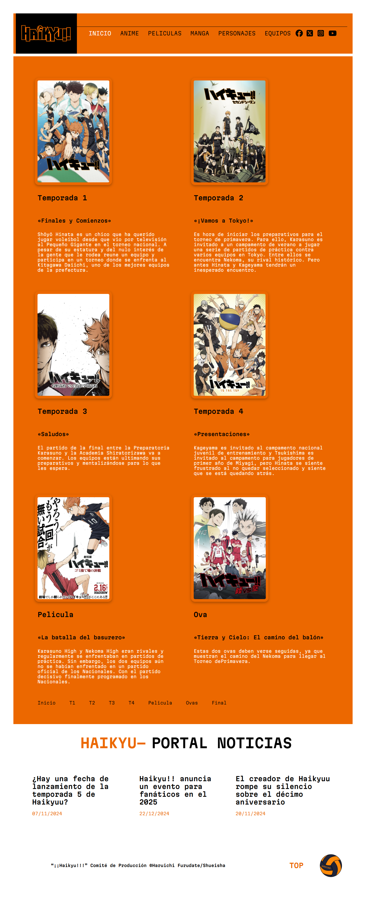
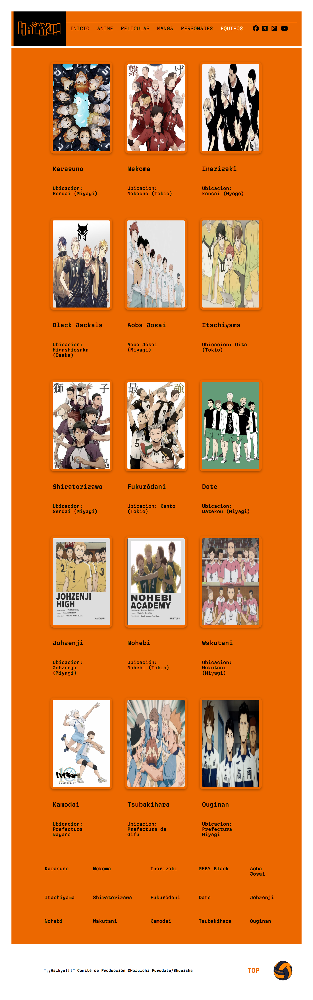
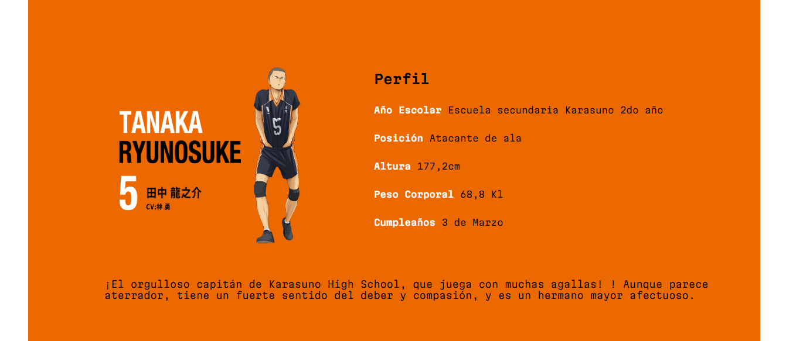

# 🏐 Página Web de Fans de Haikyuu!! 🏐

¡Bienvenidos al sitio web definitivo para los fanáticos de **Haikyuu!!**! 🌟 Este proyecto está diseñado para ser un espacio interactivo y visualmente atractivo donde los fans puedan explorar información sobre personajes, equipos y mucho más.

## 🖼️ Capturas de Pantalla

### 🌟 Página Principal
¡Explora la página principal llena de contenido emocionante sobre Haikyuu!

### 🏐 Detalles de Equipos:
Descubre los perfiles de los equipos:

### 🏐 Detalles de los jugadores:
Descubre los perfiles de todos los personajes:

### 🔗 Créditos
Agradecimientos al equipo detrás del desarrollo de este sitio:

## 🎨 Características

- Información detallada sobre equipos y jugadores.
- Contenido dinámico para los fans de **Haikyuu!!**.
- Diseño intuitivo y atractivo.
- Las ultimas noticias de la franquicia.

## 💻 Tecnologías Utilizadas

Este proyecto fue construido con:

- **HTML**: 68.1%
- **CSS**: 31.9%

🚧 Nota Importante
Actualmente, la página no es responsive y está diseñada únicamente para pantallas de computador. Próximamente, se desarrollará soporte para dispositivos móviles y tablets.

Este proyecto está bajo la Licencia MIT. Consulta el archivo [LICENSE](LICENSE) para más detalles.

